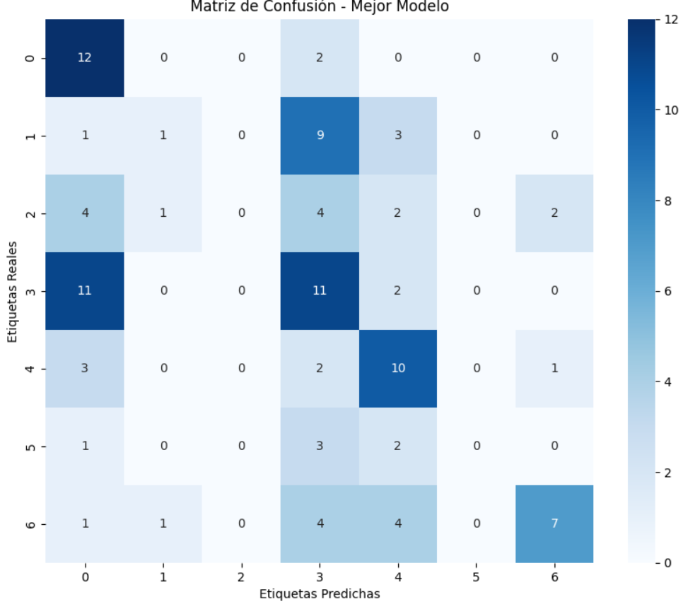

# Reto MicroscopIA <!-- omit in toc -->

- [1. Instrucciones de ejecución](#1-instrucciones-de-ejecución)
- [2. Preparación](#2-preparación)
- [3. Preprocesamiento de las imagenes](#3-preprocesamiento-de-las-imagenes)
- [4. Modelamiento](#4-modelamiento)
  - [4.1. Modelo base (InceptionResNetV2)](#41-modelo-base-inceptionresnetv2)
  - [4.2 Nueva “cabeza” de clasificación](#42-nueva-cabeza-de-clasificación)
  - [4.3. Compilación](#43-compilación)
- [Resultados](#resultados)

# 1. Instrucciones de ejecución

Clone el repositorio:

``` bash
git clone [url]
```

Ubíquese en el directorio de trabajo
```bash
cd RETO-MICROSCOPIA
```

Descargue y descomprima la carpeta `data.zip` del siguiente [enlace](https://drive.google.com/file/d/1vHpktP4M3uQOoh_QlBAqcvC111o8e5ef/view). Debería quedar con la siguiente estructura de directorios:
```
RETO-MICROSCOPIA
|_data
|___Fold1
|___Fold2
|_src
|___Reto.ipynb
|_figs
```
Ejecute el notebook ubicado en `src/Reto.ipynb`.
Este notebook contiene la preparación, el preprocesamiento de las imagenes y el modelamiento.

# 2. Preparación
Separamos las imagenes en los conjuntos de entrenamiento (70%), test (15%)y validación (15%)

- Tamaño del conjunto de entrenamiento: 483
- Tamaño del conjunto de validación: 104
- Tamaño del conjunto de prueba: 104

Creeamos el vector de etiquetas y realizamos one hot.

Número de categorías: 7

Categorías: ['aca_bd', 'aca_md', 'aca_pd', 'nor', 'scc_bd', 'scc_md', 'scc_pd']

# 3. Preprocesamiento de las imagenes
Todas las imágenes se normalizan a [0, 1] dividiendo cada píxel por 255 y se reescalan a un tamaño 224 x 224.
 
En el conjunto de entrenamiento se realiza data aumentation por medio de los generadores de Keras para crear versiones modificadas (rotadas, volteadas, con distinto brillo) cada vez que se leen, de forma aleatoria. Los parametros usados fueron:
- `rotation_range=20`, Permite rotar aleatoriamente la imagen hasta ±20 grados.Sirve para que el modelo sea más robusto a la orientación de los objetos.
- `horizontal_flip=True`, Invierte la imagen horizontalmente con probabilidad aleatoria. Útil cuando el objeto de interés no depende de la orientación izquierda/derecha.
- `brightness_range=[0.9,1.1]`, Cambia aleatoriamente el brillo de la imagen en un rango entre 90% y 110% del valor original. Ayuda a que el modelo sea más robusto a variaciones de iluminación.


# 4. Modelamiento

Se usó una red preentrenada **InceptionResNetV2** como extractor de características congelado, y encima se le agrego una “cabeza” ligera de clasificación adaptada al dataset. Así se aprovecha lo aprendido en ImageNet y se entrenas mucho más rápido con menos datos.

## 4.1. Modelo base (InceptionResNetV2)

```python
base_model = InceptionResNetV2(
    input_shape=(224, 224, 3),
    weights='imagenet',
    include_top=False)
```

* Carga **InceptionResNetV2** entrenada en **ImageNet** (millones de imágenes).
* `include_top=False` → quita la parte final (clasificador original de 1000 clases).
* Se queda solo con la parte de **extracción de características** (convoluciones profundas).
* La entrada será imágenes de tamaño `224x224` con 3 canales (RGB).

```python
for layer in base_model.layers:
    layer.trainable = False
```

* Bloquea los pesos de InceptionResNetV2 → no se entrenan de nuevo.
* Así, se aprovechan las **características ya aprendidas** (bordes, texturas, formas).
* Solo se entrena la nueva “cabeza” que agregamos después.


## 4.2 Nueva “cabeza” de clasificación

```python
transfer_learning_model = Sequential(
    [
        base_model,
        GlobalAveragePooling2D(),        # reduce mapas de características → vector
        Dense(32, activation='relu'),    # capa densa pequeña
        Dropout(0.2),                    # regularización (evita sobreajuste)
        Dense(16, activation='relu'),    # otra capa densa
        Dense(num_classes, activation='softmax')  # salida con probabilidad por clase
    ]
)
```

* **`GlobalAveragePooling2D()`** Toma cada mapa de características de la red base y calcula un promedio → convierte el tensor en un vector aplanado.

* **Capas densas (`Dense`)** Capas completamente conectadas para la clasificación.
  
* **Dropout (0.2)** Apaga aleatoriamente el 20% de las neuronas durante entrenamiento → previene **overfitting**.

* **Capa final `Dense(num_classes, softmax)`** Genera la predicción → una probabilidad para cada clase.


## 4.3. Compilación

```python
transfer_learning_model.compile(
    optimizer='adam',
    loss='categorical_crossentropy',
    metrics=['accuracy'])
```

* Usa el optimizador **Adam**.
* La función de pérdida es **categorical crossentropy**, adecuada para clasificación multiclase.
* Métrica de desempeño: **accuracy**.


# Resultados

Al evaluar el modelo construido sobre el conjunto de evaluación (test), se obtuvieron las siguiente métricas:

|          | precision | recall | f1-score | support |
|----------|-----------|--------|----------|---------|
| aca_bd   | 0.36      | 0.86   | 0.51     | 14      |
| aca_md   | 0.33      | 0.07   | 0.12     | 14      |
| aca_pd   | 0.00      | 0.00   | 0.00     | 13      |
| nor      | 0.31      | 0.46   | 0.37     | 24      |
| scc_bd   | 0.43      | 0.62   | 0.51     | 16      |
| scc_md   | 0.00      | 0.00   | 0.00     | 6       |
| scc_pd   | 0.70      | 0.41   | 0.52     | 17      |
| accuracy |           |        | 0.39     | 104     |
| macro avg| 0.31      | 0.35   | 0.29     | 104     |
| weighted avg | 0.35  | 0.39   | 0.33     | 104     |


La Matriz de confusión obtenida fue:
